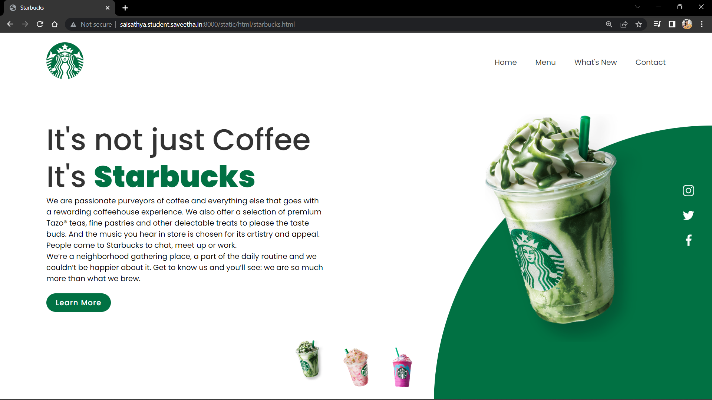
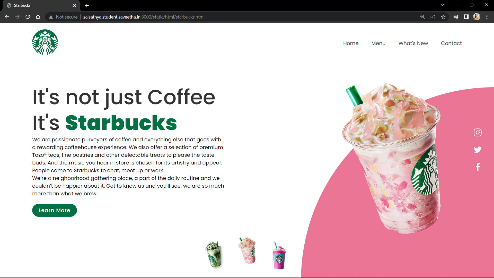
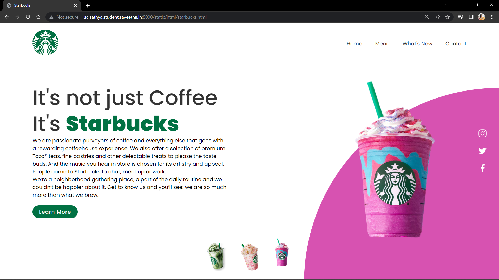
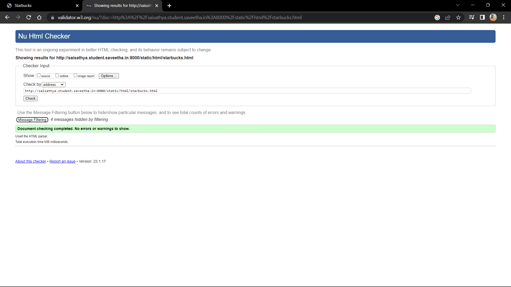

# Product Company Website
## AIM:
To develop a static company website to display the sale of products.

## Design Steps:

### Step 1:
Requirement collection.

### Step 2:
Creating the layout using HTML CSS and JavaScript.

### Step 3:
Updating the sample content.

### Step 4:
Choose the appropriate style and color scheme.

### Step 5:
Validate the layout in various browsers.

### Step 6:
Validate the HTML code.

### Step 7:
Publish the website in the given URL.

## Code:
```

starbucks.html

<!DOCTYPE html>
<html lang="en">

<head>
    <meta charset="UTF-8">
    <meta name="viewport" content="width=device-width, initial-scale=1.0">
    <meta http-equiv="X-UA-Compatible" content="ie=edge">
    <title>Starbucks</title>
    <link rel="stylesheet" href="/static/CSS/styl.css">
</head>

<body>
    <section>
        <div class="circle"></div>
        <header>
            <a href="#"> </a>
            <div class="toggle" onclick="toggleMenu();"></div>
            <ul class="navigation">
                <li> <a href="#"> Home</a> </li>
                <li> <a href="#"> Menu</a></li>
                <li><a href="#">What's New</a></li>
                <li><a href="#">Contact</a></li>
            </ul>
        </header>

        <div class="content">
            <div class="textBox">
                <h2>
                    It's not just Coffee <br> It's <span>Starbucks</span>
                </h2>
                <p>We are passionate purveyors of coffee and everything else that goes with a rewarding coffeehouse experience. We also offer a selection of premium Tazo® teas, fine pastries and other delectable treats to please the taste buds. And the music you hear in store is chosen for its artistry and appeal. People come to Starbucks to chat, meet up or work.<br>We’re a neighborhood gathering place, a part of the daily routine and we couldn’t be happier about it. Get to know us and you’ll see: we are so much more than what we brew.
                    </p>
                <a href="#">Learn More</a>
            </div>

            <div class="imgBox">
                
            </div>
        </div>

        <ul class="thumb">
            <li></li>
            <li></li>
            <li></li>
        </ul>

        <ul class="sci">
            <li><a href="#"></a></li>
            <li><a href="#"></a></li>
            <li><a href="#"></a></li>
        </ul>
    </section>

    <script src="/static/JS/script.js"></script>
</body>

</html>

styles.css

@import url('https://fonts.googleapis.com/css2?family=Poppins:wght@300;400;500;600;700;800;900&displayc=swap');
*{
    font-family: 'Poppins', sans-serif;
    margin: 0px;
    padding: 0px;
    box-sizing: border-box;
}

section{
    position: relative;
    width: 100%;
    min-height: 100vh;
    padding: 100px;
    display: flex;
    justify-content: space-between;
    align-items: center;
    background-color: #fff;
}

header{
    position: absolute;
    top: 0;
    left: 0;
    width: 100%;
    padding: 20px 100px;
    display: flex;
    justify-content: space-between;
    align-items: center;
}

header .logo{
    position: relative;
    max-width: 80px;
}

header ul{
    position: relative;
    display: flex;
}

header ul li{
    list-style: none;
}

header ul li a{
    display: inline-block;
    color: #333;
    font-weight: 400;
    margin-left: 40px;
    text-decoration: none;
}

.content{
    position: relative;
    width: 100%;
    display: flex;
    justify-content: space-between;
    align-items: center;
}

.content .textBox{
    position: relative;
    max-width: 600px;
}

.content .textBox h2{
    color: #333;
    font-size: 4rem;
    line-height: 5rem;
    font-weight: 500;
}

.content .textBox h2 span{
    color: #017143;
    font-size : 4rem;
    font-weight : 900;
}

.content .textBox a{
    display: inline-block;
    margin-top: 20px;
    padding: 8px 20px;
    background: #017143;
    color: #fff;
    border-radius: 40px;
    font-weight: 500;
    letter-spacing: 1px;
    text-decoration: none;
}

.content .imgBox{
    width: 600px;
    display: flex;
    justify-content: flex-end;
    padding-right: 50px;
    margin-top: 50px;
}

.content .imgBox img{
    max-width: 340px;

}

.thumb{
    position: absolute;
    left: 50%;
    bottom: 20px;
    transform: translateX(-50%);
    display: flex;
}

.thumb li{
    list-style: none;
    display: inline-block;
    margin: 0 20px;
    cursor: pointer;
    transition: .5s;
}

.thumb li:hover{
    transform: translateY(-15px);
}

.thumb li img{
    max-width: 60px;
}

.sci{
    position: absolute;
    top: 50%;
    right: 30px;
    transform: translateY(-50%);
    display: flex;
    justify-content: center;
    align-items: center;
    flex-direction: column;
}.sci li{
    list-style: none;
}

.sci li a{
    display: inline-block;
    margin: 5px 0;
    transform: scale(0.6);
    filter: invert(1);
}


.circle{
    position: absolute;
    top: 0;
    left: 0;
    width: 100%;
    height: 100%;
    background-color: #017143;
    clip-path: circle(600px at right 800px);
}


@media(max-width:991px){
      header{
          padding: 20px;
      }

      header.logo{
         
          max-width: 60px;
      }

      header ul{
          display: none;
      }
      .toggle{
          position: relative;
          width: 30px;
          height: 30px;
          cursor: pointer ;
          background: url(/static/images/menu.png);
          background-size: 30px;
          background-position: center;
          background-repeat: no-repeat;
          filter: invert(1);
      }

      .toggle.active{
        background: url(/static/images/close.png);
        background-size: 25px;
        background-position: center;
        background-repeat: no-repeat;
        filter: invert(1);
      }

      header ul.navigation.active{
        position: fixed;
        top: 0;
        left: 0;
        width: 100%;
        height: 100%;
        display: flex;
        justify-content: center;
        align-items: center;
        flex-direction: column;
        background-color: #fff;
        z-index: 10;
      }

      header ul li a{
          font-size: 1.5rem;
          margin: 5px 0;
         
      }

      section{
          padding: 20px 20px 120px;
      }

      .content{
          flex-direction: column;
          margin-top: 100px;
      }

      .content .imgBox{
          max-width: 100%;
          justify-content: center;
      }

      .content .imgBox img{
          max-width: 300px;
      }

      .content .textBox{
          max-width: 100px;
      }

      .content .textBox h2{
          font-size: 2.5rem;
          margin-bottom: 15px;
      }

      .circle{
          clip-path: circle(400px at center bottom);
      }

      .thumb li img{
          max-width: 40px;
      }

      .sci{
          background-color: #017143;
          right: 0;
          width: 50px;
          border-top-left-radius: 5px;
          border-bottom-left-radius: 5px;
      }
}

script.js

function imgSlider(anything){
    document.querySelector(".starbucks").src = anything;
}

function changeCircleColor(color){
   const circle = document.querySelector(".circle");
   circle.style.background=color;
}

function toggleMenu(){
    var menuToggle = document.querySelector('.toggle');
    var navigation = document.querySelector('.navigation');
    menuToggle.classList.toggle('active')
    navigation.classList.toggle('active');
}

```

## Output:




## HTML Validator


## Result:
The program for designing company website for sale of products using HTML,CSS and JavaScript is completed successfully.